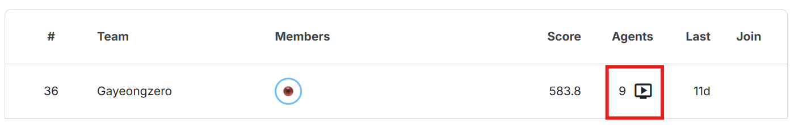

# 📘 ConnectX Reinforcement Learning Agents

> Kaggle ConnectX 환경을 기반으로 여러 강화학습 기법(One-step, N-step, DQN 등)을 구현하고 비교하여, 가장 우수한 전략을 찾는 프로젝트입니다.
>
> **프로젝트 인원**: A72066 이가영, A72076 이현지
>
> **프로젝트 PPT** : [강화학습의 기초_4조_PPT_A72066 이가영,A72076 이현지.pptx](https://github.com/gayeongge/2025_RL_Project/blob/main/%EA%B0%95%ED%99%94%ED%95%99%EC%8A%B5%EC%9D%98%EA%B8%B0%EC%B4%88_4%EC%A1%B0_PPT_A72066%20%EC%9D%B4%EA%B0%80%EC%98%81%2C%20A72076%20%EC%9D%B4%ED%98%84%EC%A7%80.pptx)

---

## 📑 목차

1. [빠른 시작](#-빠른-시작)
2. [프로젝트 개요](#-프로젝트-개요)
3. [프로젝트 구조](#-프로젝트-구조)
4. [에이전트 종류](#-에이전트-종류)
5. [분석 리포트 실행](#-분석-리포트-실행)
6. [로컬 테스트 가이드](#-로컬-테스트-가이드)
7. [Submission 생성 및 제출](#-submission-생성-및-제출)
8. [Troubleshooting](#-troubleshooting--성능-개선-가이드)

---

## 🚀 빠른 시작

> 프로젝트 수행 환경은 vscode에서 진행하였습니다.

### 환경 설정

```bash
# python 3.13 기준
# 1. 가상환경 생성
python -m venv .venv
# py -3.13 -m venv .venv

# 2. 가상환경 실행
.venv\Scripts\activate.bat

# 3. 필수 패키지 설치
pip install -r requirements.txt
pip install --no-deps kaggle-environments==1.11.1, jsonschema, attrs
```

### 에이전트 테스트

1. VS Code에서 `src/run_agen.ipynb` 열기
   - ⚠️ **주의**: `submission_files` 폴더도 `src` 밑에 같은 경로에 있어야 함
   - 커널 환경 위에서 생성한 가상 환경으로 설정하고, 추가 패키지 설치하기
2. 셀 3 (설정)에서 `PLAYER1_KEY`, `PLAYER2_KEY` 수정
3. 셀 4 (실행)를 돌려 ConnectX 한 판 플레이

---

## ✨ 프로젝트 개요

ConnectX 강화를 위한 실험 환경과 문서를 동시에 제공하기 위해 다음 항목에 집중합니다:

- ConnectX 환경에서 동작하는 휴리스틱·탐색·신경망 기반 에이전트를 통합 관리하고 실험
- One-step, N-step, AlphaZero 스타일 MCTS, DQN 계열까지 발전 과정을 문서화
- Kaggle 제출 규격을 만족하는 자동 submission 생성 파이프라인을 유지·개선
- VSCode + Local Python + Kaggle Environments 조합에서 재현 가능한 테스트/디버깅 환경 제공
- 동일 경기 조합을 반복 실행해 승률을 비교할 수 있는 실험 스크립트/리포트 템플릿 제공

---

## 📁 프로젝트 구조

아래 구조도는 자주 사용하는 폴더와 파일만 추려 설명했습니다. 나머지 세부 사용법은 각 폴더의 README 또는 summary 페이지를 참고하세요.

```
20205_RL_Project/
├── README.md                        # 프로젝트 개요와 실행 가이드
├── requirements.txt                 # 로컬 실험용 필수 패키지 목록
├── requirements_kaggle.txt          # Kaggle 노트북용 최소 의존성
├── kaggle.png                       # 리더보드/결과 스크린샷
└── src/
    ├── agents.txt                   # 제출 대상 agent 이름 목록
    ├── make_submission.py           # agents.txt를 읽고 submission_*.py 생성
    ├── run_agen.ipynb               # agent 벤치마크 및 재생산 노트북
    ├── ALphazeor/                   # AlphaZero + MCTS self-play 구현
    ├── DQN/                         # DQN/Double/Dueling 등 value-based agent
    ├── MTDF/                        # Negamax / MTD(f) 탐색 기반 agent
    ├── Normal/                      # Greedy / Minimax lookahead baseline
    ├── analysis/
    │   ├── dqn_analysis/            # DQN 실험 자동화 및 요약 리포트
    │   ├── league/                  # Cross-play 리그/메트릭 분석
    │   └── reliability/             # seed 안정성 측정/시각화 도구
    └── submission_files/            # Kaggle 업로드용 submission_*.py 산출물
```

> **팁**: `src/analysis/*/summary_page.md` 문서를 먼저 읽으면 각 실험 폴더의 목적과 실행 순서를 빠르게 파악할 수 있습니다.

---

## 🤖 에이전트 종류

### Greedy & Lookahead (`src/Normal/`)

- `simple_greedy_baseline.py`: 기본 휴리스틱 / 한 수 앞 탐색
- `minimax_basic_search.py`: Minimax / Alpha-Beta 기반 탐색기

### MTD(f) (`src/MTDF/`)

- `mtdf_negamax_strategic.py`: 루트 추적·안정화 로직을 포함한 변형

### AlphaZero MCTS (`src/ALphazeor/`)

- `alphazero_mcts_gap_defense.py`: Gap-Defense self-play 에이전트

### DQN 패밀리 (`src/DQN/`)

- `drl_dqn.py`: 기본 DQN 구현
- `drl_double.py`: Double DQN (가중치 안정화)
- `drl_dueling.py`: Dueling DQN (가치/이득 분리)
- 각 `.pth` 가중치 및 상태 스냅샷 포함

> **참고**: `drl_dqn.py`/`drl_double.py`/`drl_dueling.py`를 학습 모드로 실행하면 같은 폴더에 `drl_dqn_weights.pth`, `drl_double_weights.pth`, `drl_dueling_weights.pth`가 생성됩니다(제출용 `.py`와 함께 버전에 맞춰 커밋됨).

### Kaggle 제출용 (`src/submission_files/`)

모든 에이전트는 `agents.txt`와 `make_submission.py`로 일괄 관리됩니다.

---

## 📊 분석 리포트 실행

### DQN 비교 실험

**경로**: `src/analysis/dqn_analysis/` (자세한 내용: `summary_page.md`)

```bash
cd src/analysis/dqn_analysis
python run_dqn_bench.py --games-per-order 5
python summarize.py
python plot_metrics.py
```

**산출물**: `data/*.json`, `plots/forced_rates.png`, `plots/avg_turns.png`

### Cross-play League

**경로**: `src/analysis/league/` (자세한 내용: `summary_page.md`)

```bash
cd src/analysis/league
python run_league.py --games-per-order 5 --output data/league_results.jsonl
python analyze_metrics.py --input data/league_results.jsonl
```

**산출물**: `data/metrics.json`, `plots/*.png`, `findings.md`

### Seed Reliability

**경로**: `src/analysis/reliability/` (자세한 내용: `summary_page.md`)

```bash
cd src/analysis/reliability
python seed_reliability.py --episodes 20 --seeds 0 1 2 42 999
python visualize_reliability.py --results results.json
```

**산출물**: `results.json`, `seed_reliability.png`

---

## ▶️ 로컬 테스트 가이드

### ConnectX 환경 생성 후 테스트

```python
from kaggle_environments import make
from one_step_lookahead import my_agent # 경로 수정 필요

env = make("connectx", debug=True)
env.run(["random", my_agent])
print(env.render(mode="ansi"))
```

### 에이전트 플레이어 확인

```python
env.run([my_agent, "random"])    # my_agent = Player 1
env.run(["random", my_agent])    # my_agent = Player 2
```

ANSI 렌더링에서 `1` 또는 `2`가 내 돌입니다.

---

## 🛠️ Submission 생성 및 제출

### 1단계: `agents.txt` 작성

파일명, 상대경로, 절대경로 모두 지원합니다:

```
mtdf_negamax_strategic.py
MTDF/mtdf_negamax_strategic.py
/absolute/path/to/agent.py
```

### 2단계: Submission 생성

리포지토리 루트에서 다음 명령 실행:

```bash
python src/make_submission.py
```

**결과**:

- 각 소스 파일과 같은 폴더에 `submission_<원본>.py` 생성
- 후보가 여러 개면 첫 경로를 사용하며 경고 출력
- 생성된 파일에는 Kaggle 제출 규격의 `agent` 함수 래퍼가 자동 포함

### 3단계: Kaggle 제출

1. [Kaggle ConnectX 대회](https://www.kaggle.com/competitions/connectx) 페이지로 이동
2. **"Submit Agent"** 클릭
3. 생성된 `submission_*.py` 파일 업로드
4. **Submit!**

---

## 📈 Kaggle Leaderboard 추적

[Kaggle 리더보드 링크](https://www.kaggle.com/competitions/connectx/leaderboard?search=Gayeongzero)

현재 제출된 에이전트는 **MTDF 전략의 최신 버전**입니다. "에이전트" 버튼을 클릭하면 대회 참가자들 간 자동 리그에서 각 에이전트의 성과를 지속적으로 확인할 수 있습니다.



---

## ❗ Troubleshooting & 성능 개선 가이드

### 🎯 MTD(f) 계열 (`src/MTDF/`)

| 문제 | 원인 | 해결책 |
|------|------|--------|
| **부호 오류로 승부 결과 뒤바뀜** | player/root_player 비교 방식의 혼동 | Negamax 알고리즘 도입으로 항상 현재 플레이어 관점에서 점수 계산 |
| **시간 초과시 쓰레기 값 반환** | 미완료 탐색 결과를 그대로 사용 | `try-except TimeoutError`로 완료된 이전 깊이 결과 사용 (safe-fail) |
| **동일 효과 승리수 중 비효율적 선택** | 높이 고려 없이 첫 번째 발견된 승리수 선택 | `get_column_height()`로 낮은 높이 우선 선택하여 여유있는 승리 |
| **자살수로 상대에게 승리 기회 제공** | 내 수 후 상대 즉시 승리 가능 여부 미검사 | `check_suicide_move()`로 위험한 수 사전 배제 |

**성능 개선 결과**: negamax vs basic MTD(f) 승률 0% → 100%

### 🔄 Normal 에이전트 계열 (`src/Normal/`)

| 문제 | 원인 | 해결책 |
|------|------|--------|
| **1수 앞만 보여 함정에 빠짐** | 즉석 평가만으로 전략적 깊이 부재 | Minimax 알고리즘으로 3수 앞 미래 시나리오 탐색 |
| **탐색 속도 너무 느림** | Alpha-beta 가지치기 없이 모든 노드 방문 | (현재 기본/제출 버전은 동일한 3수 minimax 흐름) → 향후 Alpha-beta + 이동 정렬 도입 예정 |
| **동일 보드 상태 중복 계산** | 전이표(해시테이블) 없어 같은 상황 재계산 | ⚠️ **추후 개선 필요**: Zobrist 해싱 + 전이표 도입 고려 |

**알고리즘 진화**: O(열수, `simple_greedy_baseline`) → O(분기^깊이, `minimax_basic_search` / `submission_n_step_lookahead` : 동일한 코드)

### 🧠 DQN 계열 (`src/DQN/`)

| 문제 | 원인 | 해결책 |
|------|------|--------|
| **Q값 폭주로 학습 불안정** | 동일 네트워크로 행동·가치 동시 추정 | 온라인/타깃 네트워크 분리한 Double DQN 도입 |
| **열별 가치 구분 못함** | 단일 Q값으로 미묘한 차이 표현 한계 | Value/Advantage 분리한 Dueling 아키텍처 |
| **Kaggle 점수 저조** | 기본 보상 체계 + 유효 열 마스킹 부재로 장기 전략/안정성 부족 | Double/Dueling 조합 + playable 열 마스킹으로 안정화 (보상 셰이핑은 TODO) |
| **제출 후 추가 학습 필요** | 가중치 미내장 상태 | `EMBEDDED_STATE_DICT` 내장으로 학습 없이 제출 가능 |
